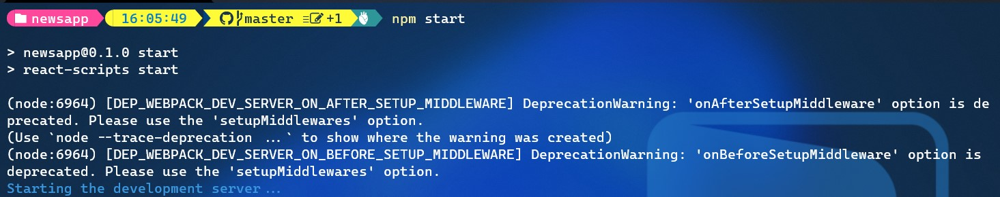
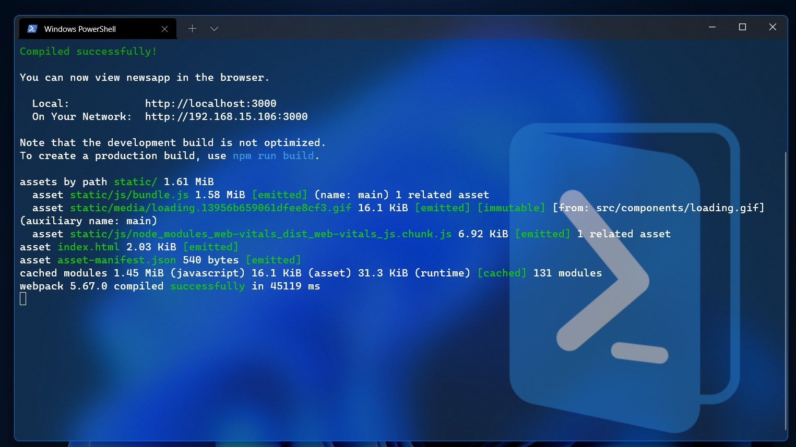
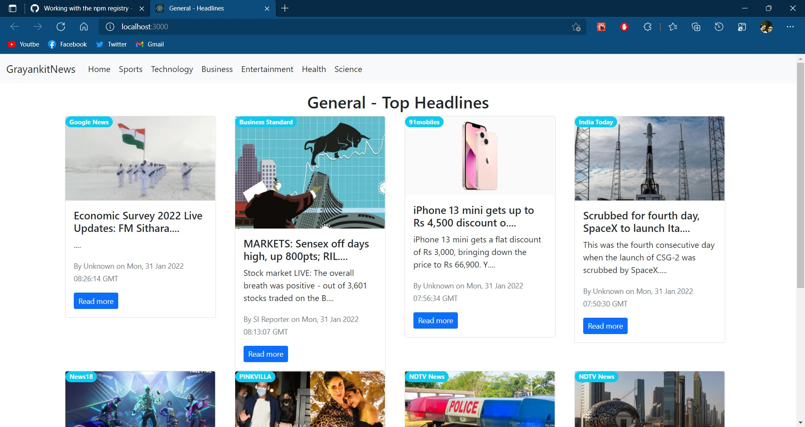

# Welcome to Grayankit News
## A app build with react to start your day
# Clone the repo using
## Using Git
### `git clone https://github.com/grayankit/grayankitNews.git`
## Using Github CLI
### `gh repo clone grayankit/grayankitNews`
## Using SSH
### `git@github.com:grayankit/grayankitNews.git`

# Running site
## Install node js or yarn
### [Node js Download](https://nodejs.org/en/download/)
### `cd grayankitNews`
## Install dependencies using following command
### `npm install` for Node js
## Run the site on localhost using
### `npm start` for Node Js

## Wait for the process to complete
You terminal will look like this output :

And here your site is Ready

# Notes
* ## Use your api key in code
* ## This site will only work in localhost with this api
* ## Generate your API key on this website [News API](https://newsapi.org/)

# Thanks for rading

